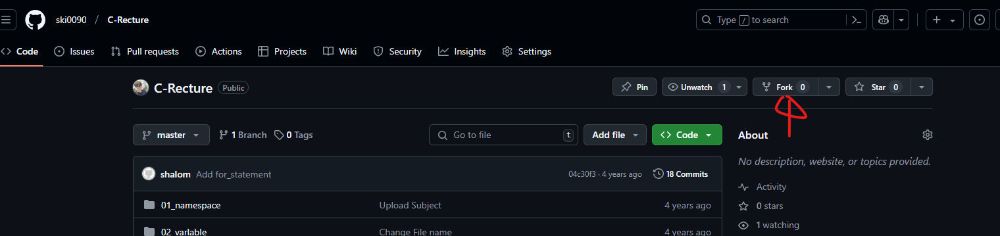
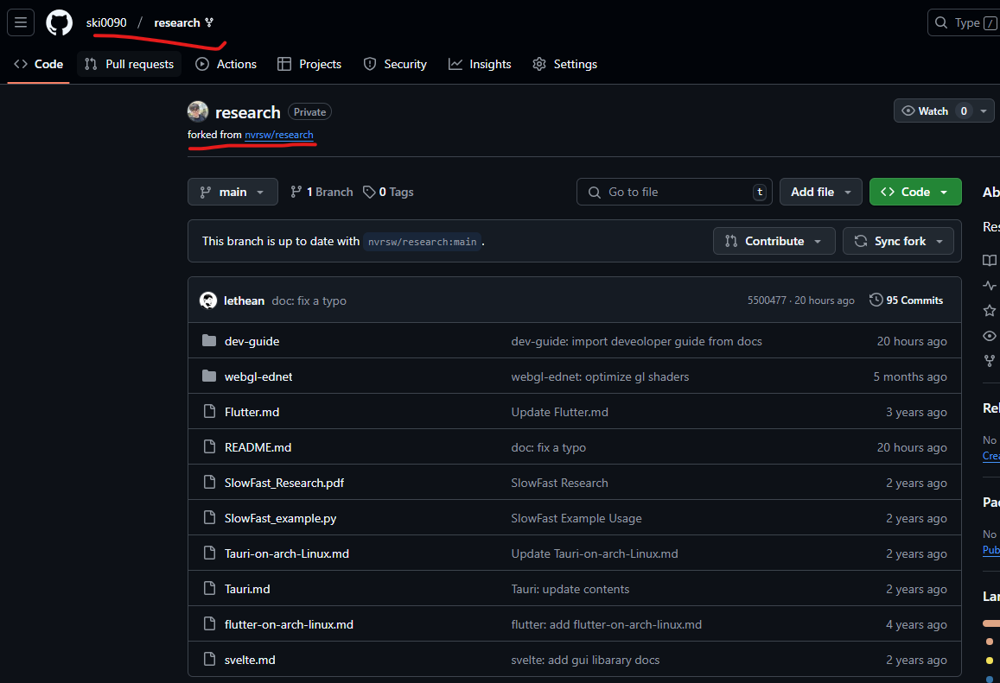
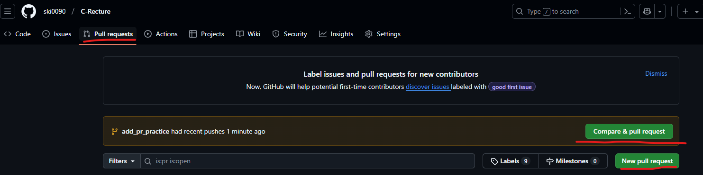
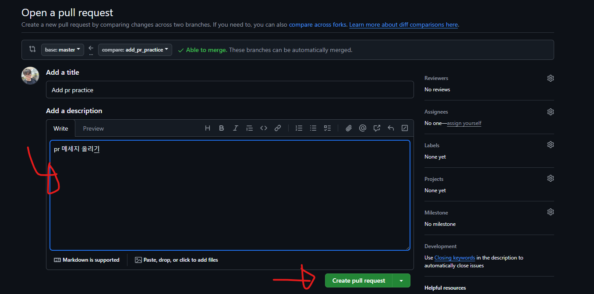

# GitHub

## 저장소 fork 따기



위 내용을 진행하면 본인만의 repo가 생김

research 예시


# git


## 저장소 clone

```powershell
git clone https://github.com/[이름]/C-Recture.git
```

## 브랜치 만들기

```powershell
git checkout -b [브랜치 이름]
```

## 내용 편집 후 commit

```powershell
git add . # <- 스테이지에 올림 커밋 준비 상태
git commit -m "커밋 메세지" # 또는 git commit
# 수정이 필요할 땐
# git add .
# git commit --amend
git push origin [브랜치 이름] # GitHub에 업로드
# 수정을 한 브랜치를 업로드 하려면
# git push origin [브랜치 이름] --force
```

# PR 올리기




